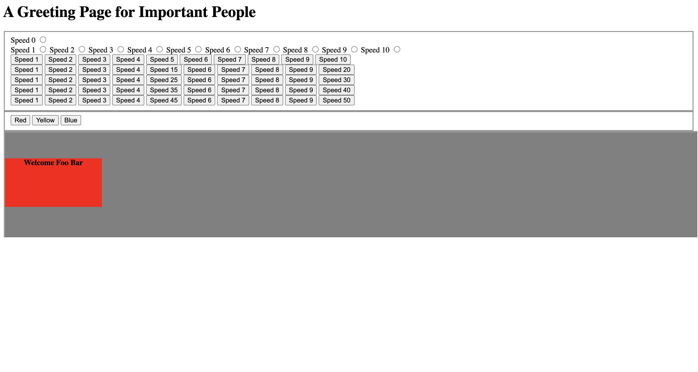

# Greeting Block
> Block that greets important people included in a list. (Some names of important people to use: Foo Bar, Joe Bruin)

## Table of contents
* [General info](#general-info)
* [Screenshots](#screenshots)
* [Technologies](#technologies)
* [Setup](#setup)
* [Features](#features)
* [Status](#status)
* [Inspiration](#inspiration)
* [Contact](#contact)

## General info
The purpose of this project is to learn how to use Javascript, CSS, and HTML to create an interactive website

## Screenshots

## Technologies
* HTML5
* CSS
* Javascript

## Demo
[Demo version of site](https://www.sengchowchoy.com/GreetingBlock)

## Features
List of features ready and TODOs for future development
* Speed of Greeting Block can be changed
* Color of Greeting Block can be changed
* Website saves the individual setting each individual make on their Greeting Block and they will see the changes they made next time they visit the website again

## Status
Project is: finished

## Inspiration
Project inspired by Michael Lindstrom, UCLA Professor who taught me in PIC40A (Introduction to Programming for the Internet) 

## Contact
Created by Seng Chow Choy - feel free to contact me at my [email](sengchowtech@gmail.com)
